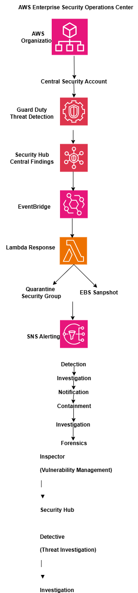
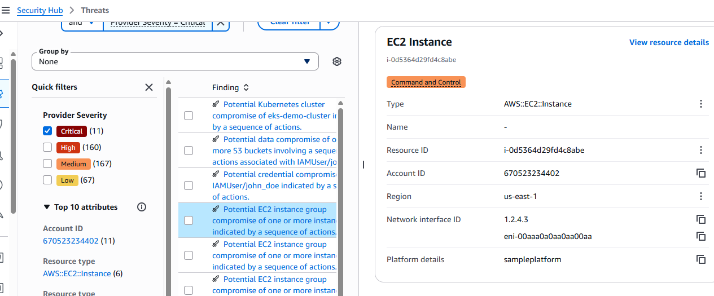
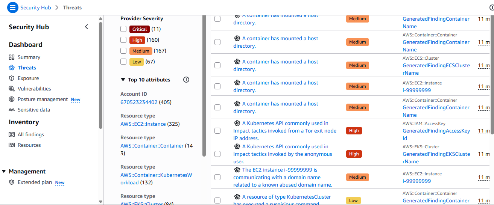
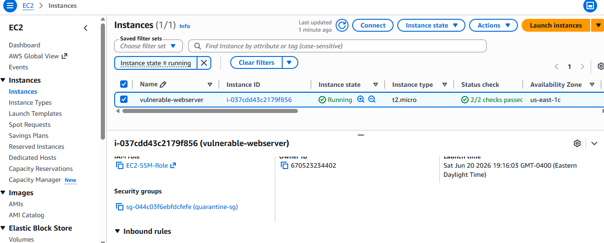
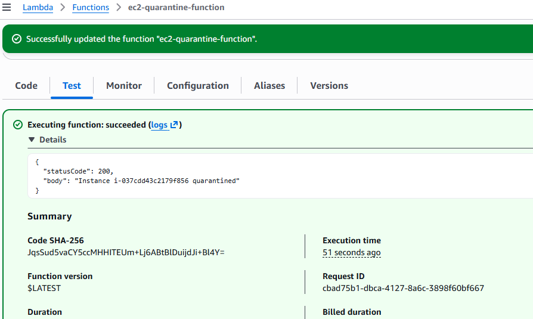

# AWS Enterprise Security Operations Center

## Security Architecture

Detection → Investigation → Notification → Containment → Forensics



## Overview

Enterprise-grade AWS Security Operations Center (SOC) built using native AWS security services and automated incident response.

This project demonstrates centralized threat detection, investigation, notification, automated containment, forensic evidence preservation, and infrastructure-as-code deployment patterns.

## Executive Summary

Designed and implemented an enterprise-grade AWS Security Operations Center (SOC) leveraging GuardDuty, Security Hub, Inspector, Detective, EventBridge, SNS, Lambda, and Terraform. Implemented automated threat detection, event-driven alerting, EC2 quarantine workflows, and forensic evidence preservation using EBS snapshots.

## Architecture Highlights

- Centralized security operations account
- Event-driven incident response
- Automated EC2 isolation
- Automated forensic evidence preservation
- Infrastructure as Code deployment using Terraform

## Key Capabilities

- AWS Organizations multi-account architecture
- Centralized Security Account
- Amazon GuardDuty threat detection
- AWS Security Hub centralized findings
- Amazon Inspector vulnerability management
- Amazon Detective investigation workflows
- EventBridge event processing
- SNS security notifications
- Automated EC2 quarantine
- Automated EBS forensic snapshot preservation
- Terraform Infrastructure as Code

## Security Operations Workflow

Detection
↓
Investigation
↓
Notification
↓
Containment
↓
Forensics

## Business Impact

- Reduced incident response time through automation
- Automated containment of compromised EC2 instances
- Preserved forensic evidence for investigations
- Centralized security visibility across AWS accounts
- Demonstrated event-driven security operations using native AWS services
- Automated containment reduced manual analyst intervention during incident response

## Project Metrics

| Capability | Status |
|------------|---------|
| GuardDuty | ✅ Implemented |
| Security Hub | ✅ Implemented |
| Inspector | ✅ Implemented |
| Detective | ✅ Implemented |
| EventBridge | ✅ Implemented |
| SNS Notifications | ✅ Implemented |
| Automated Quarantine | ✅ Implemented |
| EBS Snapshot Preservation | ✅ Implemented |
| Terraform | ✅ Implemented |
| Runbooks | ✅ Implemented |
| Incident Response Runbooks | ✅ Implemented |
| Forensic Procedures | ✅ Implemented |

## Technologies Used

- AWS Organizations
- Amazon GuardDuty
- AWS Security Hub
- Amazon Inspector
- Amazon Detective
- Amazon EventBridge
- Amazon SNS
- AWS Lambda
- Amazon EC2
- Amazon EBS
- AWS IAM
- Terraform
- GitHub

## Implementation Walkthrough

1. Architecture Overview
2. AWS Organizations Setup
3. GuardDuty Deployment
4. Security Hub Deployment
5. Inspector Deployment
6. Threat Detection Validation
7. Automated Incident Response
8. Lessons Learned
9. Tradeoffs and Design Decisions

# Threat Detection Validation

## Scenario

GuardDuty Attack Sequence Detection

## Finding

AttackSequence:EC2/CompromisedInstanceGroup

## Severity

Critical

## Evidence





## Outcome

Successfully validated GuardDuty attack sequence detection and Security Hub integration.

# Automated Incident Response

## Objective

Notify security teams when GuardDuty identifies critical threats.

## Workflow

GuardDuty → EventBridge → SNS → Email

## Benefits

- Near real-time alerting
- Reduced mean time to detection
- Centralized notification workflow

## Status

Completed

## Event-Driven Notification Architecture

Implemented EventBridge rules to process GuardDuty findings and route security events to SNS notification channels.

Services:
- GuardDuty
- EventBridge
- SNS

Outcome:
Established event-driven security notification architecture for threat detection workflows.

## Event-Driven Security Notifications

Implemented EventBridge integration for GuardDuty findings and SNS notifications.

Architecture:

GuardDuty → EventBridge → SNS → Email

Validation:

- EventBridge rule created
- SNS topic configured
- Email subscription confirmed
- GuardDuty sample findings generated

Notes:

AWS sample findings were successfully generated and centralized in Security Hub. EventBridge integration was configured as the foundation for production notification workflows.

# Amazon Detective Investigation

## Services

- Amazon Detective
- Amazon GuardDuty
- AWS Security Hub

## Objective

Investigate and correlate security findings to accelerate incident response.

## Validation

Amazon Detective was enabled and integrated with the centralized security operations environment.

## Notes

Due to the lab environment and limited telemetry history, Detective did not generate finding groups during the testing window. The integration architecture was successfully deployed and validated.

# Automated Containment

## Quarantine Security Group

A dedicated security group was created to isolate compromised EC2 instances detected by GuardDuty.

### Characteristics

- No inbound rules
- No outbound rules

### Purpose

Preserve compromised systems for forensic investigation while preventing lateral movement and command-and-control communication.

# Automated EC2 Quarantine

### Validation Evidence





## Objective

Automatically isolate compromised EC2 instances identified by security monitoring services.

## Architecture

GuardDuty
    ↓
EventBridge
    ↓
Lambda
    ↓
Quarantine Security Group
    ↓
Isolated EC2 Instance

## Components

- Amazon GuardDuty
- Amazon EventBridge
- AWS Lambda
- Amazon EC2
- Security Groups

## Validation

A Lambda function successfully modified the security group of a test EC2 instance and attached the quarantine security group.

Instance:
i-037cdd43c2179f856

Quarantine Security Group:
sg-044c03f6ebfdcfefe

## Outcome

Compromised workloads can be automatically isolated to prevent lateral movement and outbound command-and-control communications while preserving forensic evidence.

## Infrastructure as Code

Core security automation resources were codified using Terraform to ensure repeatable deployments and version-controlled infrastructure.

### Managed Resources

* Amazon SNS Topic for GuardDuty notifications
* Email subscription for security alerts
* EC2 Quarantine Security Group
* Lambda IAM Role
* EC2 Quarantine IAM Policy

### Terraform Workflow

```bash
terraform init
terraform validate
terraform plan
```

### Benefits

* Repeatable deployments
* Infrastructure version control
* Auditable security changes
* Consistent security configuration across environments

# Lessons Learned

## Security Operations Requires Integration

Deploying individual security services provides limited value. The greatest benefit comes from integrating GuardDuty, Security Hub, Detective, EventBridge, SNS, and Lambda into a unified security operations workflow.

## Automation Reduces Response Time

Automated EC2 quarantine significantly reduces the time required to contain potentially compromised resources and minimizes reliance on manual intervention during security incidents.

## Forensics Must Be Considered Early

Security incidents require evidence preservation. Automated EBS snapshot creation ensures that forensic artifacts are retained before remediation activities occur.

## Multi-Account Security Improves Visibility

Centralizing security tooling within a dedicated Security Account provides a consolidated view of findings across environments and aligns with AWS security best practices.

## Infrastructure as Code Improves Consistency

Terraform enables repeatable deployments, version control, and auditable changes while reducing configuration drift.

## Detection Alone Is Not Enough

Threat detection is only the first step. Effective security operations require investigation, notification, containment, recovery, and continuous improvement processes.

## Real-World Challenges Encountered

During implementation several challenges were encountered:

- Cross-account access and permissions management
- EventBridge and SNS integration troubleshooting
- Terraform state and provider management
- Security service configuration across multiple AWS accounts
- Testing security workflows in a lab environment

Addressing these challenges provided valuable experience with operational cloud security practices.

# Future Enhancements

- AWS Security Lake integration
- Automated threat enrichment workflows
- Security orchestration and response (SOAR) capabilities
- ChatOps integration with Slack or Microsoft Teams
- Compliance reporting dashboards
- Multi-region incident response automation
