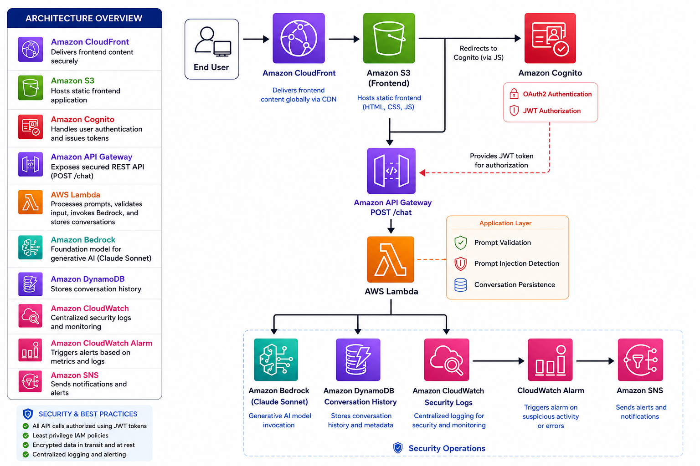

# Secure Generative AI Platform on AWS

## Overview

The Secure Generative AI Platform is an enterprise-style serverless application built entirely on AWS. It demonstrates secure user authentication, AI-powered conversations using Amazon Bedrock, conversation persistence, application-layer AI security controls, and operational monitoring using AWS native services.

The project was designed to showcase modern cloud architecture, serverless development, security best practices, and Generative AI integration suitable for enterprise environments.

---

# Objectives

* Secure user authentication using Amazon Cognito
* AI-powered conversations using Amazon Bedrock
* Serverless backend using AWS Lambda
* REST API using Amazon API Gateway
* Conversation persistence with Amazon DynamoDB
* AI prompt validation and prompt injection protection
* Security event logging using Amazon CloudWatch
* Operational monitoring with Amazon SNS

---

# AWS Services Used

* Amazon Bedrock
* Amazon Cognito
* Amazon API Gateway
* AWS Lambda
* Amazon DynamoDB
* Amazon S3
* Amazon CloudFront
* Amazon CloudWatch
* Amazon SNS
* AWS IAM

---

# Features

* Secure OAuth 2.0 authentication
* JWT-based authorization
* Serverless REST API
* AI chat powered by Amazon Bedrock
* Conversation history stored in DynamoDB
* Prompt validation
* Prompt injection detection
* Security event logging
* Least-privilege IAM implementation
* Operational monitoring foundation

---

## Architecture



---

# Project Status

| Phase                                      | Status     |
| ------------------------------------------ | ---------- |
| Phase 00 – Project Setup                   | ✅ Complete |
| Phase 01 – Frontend Hosting                | ✅ Complete |
| Phase 02 – Amazon Cognito                  | ✅ Complete |
| Phase 03 – API Gateway & Lambda            | ✅ Complete |
| Phase 04 – Amazon Bedrock                  | ✅ Complete |
| Phase 05 – Conversation Logging            | ✅ Complete |
| Phase 06 – Security Hardening              | ✅ Complete |
| Phase 07 – AI Security Controls            | ✅ Complete |
| Phase 08 – Security Operations Integration | ✅ Complete |
| Phase 09 – Documentation & Final Review    | ✅ Complete |

---

# Repository Structure

```text
Secure-Generative-AI-Platform/
├── architecture/
├── diagrams/
├── docs/
├── frontend/
├── lambda/
├── screenshots/
├── PROJECT-JOURNAL.md
└── README.md
```

---

# Skills Demonstrated

* AWS Serverless Architecture
* Generative AI Integration
* Amazon Bedrock
* Secure Authentication (OAuth 2.0 / JWT)
* REST API Development
* AWS Lambda
* Amazon DynamoDB
* Cloud Security
* IAM Least Privilege
* AI Prompt Security
* CloudWatch Monitoring
* Security Operations Concepts
